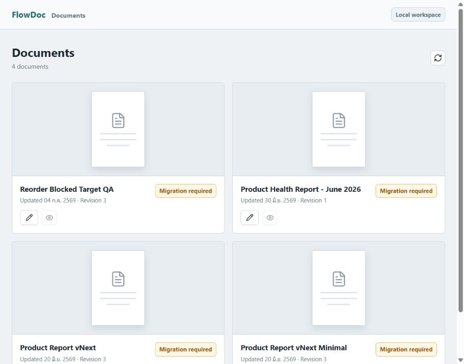
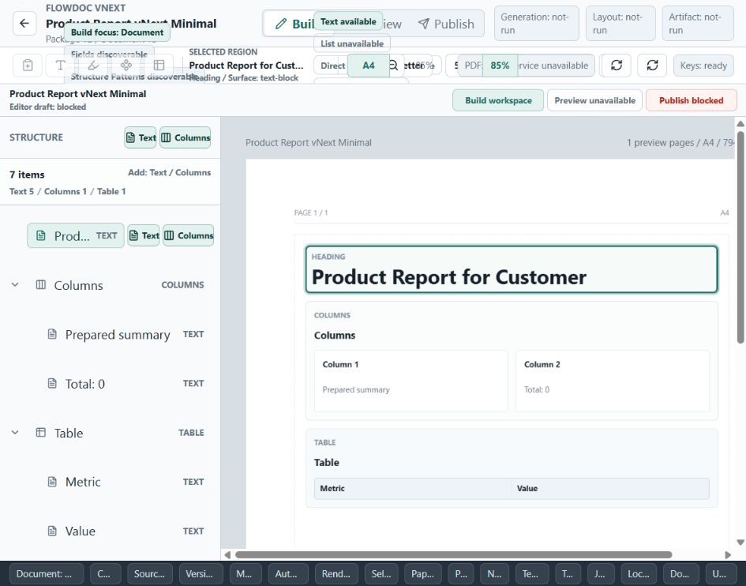
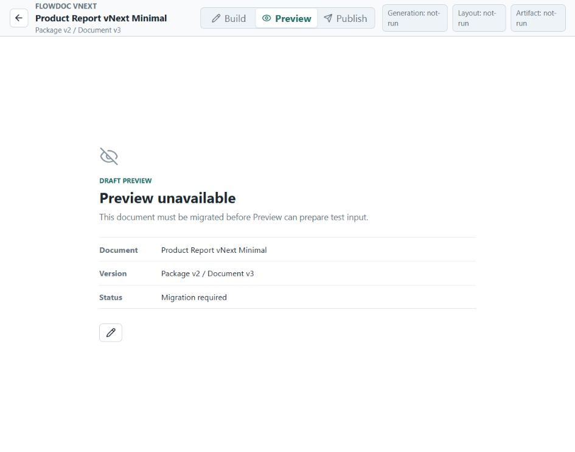
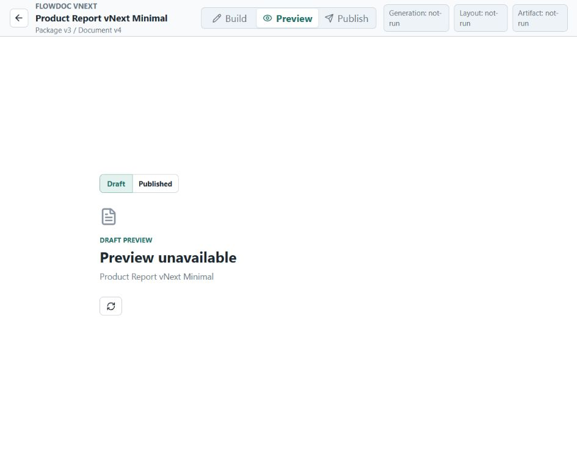
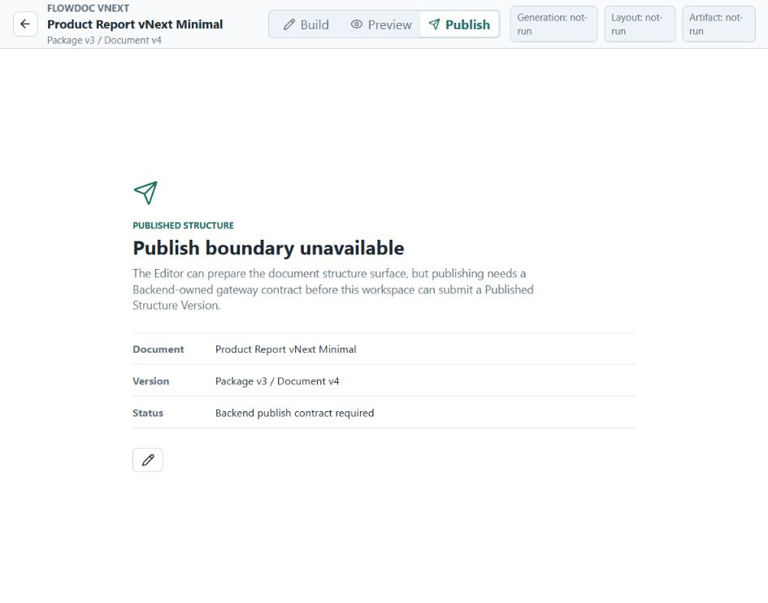
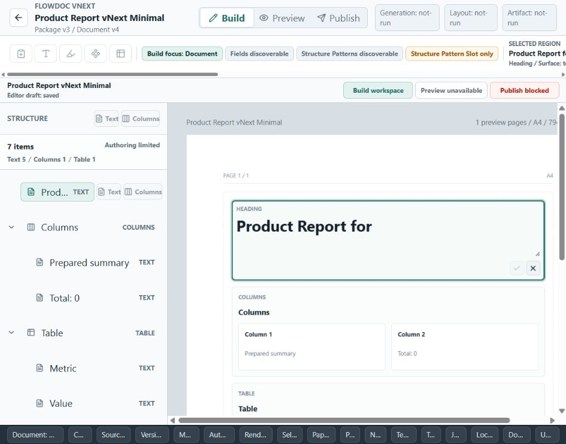
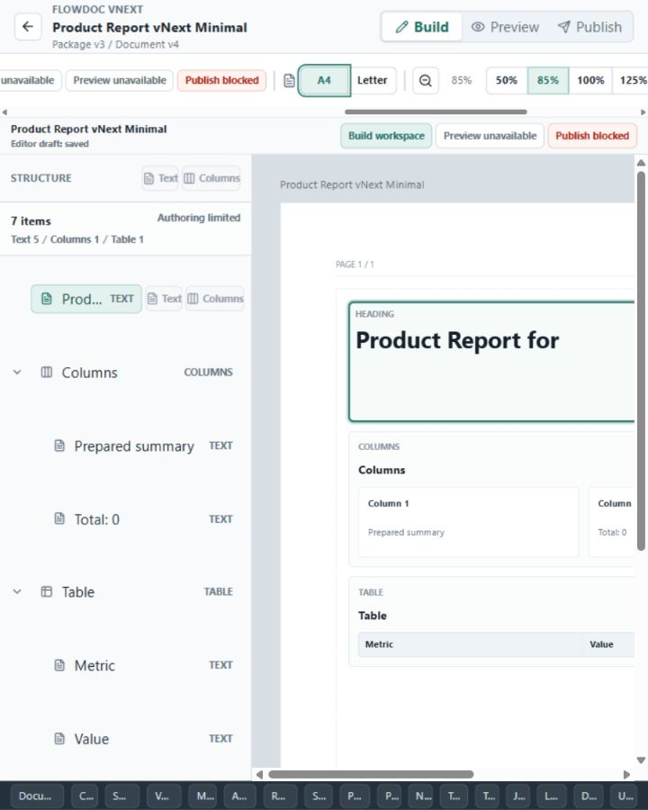

# Editor Creator Flow Audit and Toolbar Reflow

## Authority Boundary

Owner: Project Control. Work path: `flowdoc-product-development-resumption > editor-toolbar-reflow-audit`.
Product change owner: `repo-editor`. Active role: Product Implementation Agent for the bounded layout repair; Evidence Reviewer and Project Control Steward for this report.
Phase: `phase-editor-toolbar-reflow-audit`. Checklist: `checklist-editor-toolbar-reflow-audit`.
Evidence target: `evidence-editor-toolbar-reflow-audit-2026-09-05`.

This report records current local browser observations and a bounded toolbar repair. It does not prove full creator-flow readiness, accessibility compliance, Core or Backend readiness, persistence, Preview parity, Published/API readiness, PDF output, or map truth. Core, Backend, old worktrees, and the prior Core commit-reference discrepancy are unchanged.

## Scope and Method

Compared the current Editor product routes against [Creator UX Contract v0](flowdoc-creator-ux-contract-v0-2026-09-04.md): Document Structure Library → Build → Preview → Versions → Published/API.
Used the Codex in-app browser and the repository local loopback runner, with a temporary Backend process and default seeds. Inspected `product-report-vnext-minimal` before and after its supported migration. The migration changed only that temporary process's document record.
Baseline Editor: `bd07c1a54f98b3a391cbc1de06497f1aef7816d3`. Backend: `eddf727fabef035862c91d3af9eb04b884c8ac6d`.
Screenshots below were captured during this audit. The main audit viewport was 946px wide; narrow keyboard verification used 720px. Desktop geometry was also checked at 1440px. The 1440px image was clipped by the host viewport and is excluded as screenshot evidence.

## Flow Findings

1. **Library — partial.** Four seeded documents can be opened and migration status is visible. There is no visible create-document-structure action. Source inspection confirms this is the existing Backend document library, not a complete DocumentDefinition creator library.

   

2. **Build — layout defect repaired; authoring remains limited.** The document surface and outline exist. The toolbar originally put wrapping focus and selection chips into a fixed 46px row. At 946px, eight chips extended above or below the row and overlapped the header/status area. Fields and Structure Pattern controls remain policy/status affordances, not complete authoring flows. The inspector is hidden below 980px by an existing breakpoint; contextual editing access at that width needs a separate review.

   

3. **Preview — blocked for the inspected seed and environment.** Before migration it explicitly requests migration. After upgrading the seed to package 3/document 4, it still shows Preview unavailable with the document title and a retry icon. It does not explain the next useful recovery action, and the retry button has no accessible name in the observed accessibility tree. This does not show that every Preview path is unavailable; dedicated QA and local service paths were not audited.

   
   

4. **Versions — missing from the inspected product navigation.** The workspace has Build, Preview, and Publish tabs. `src/app/documentWorkspaceRoute.ts` and the workspace router do not define a Versions view. There is no visible freeze-history or frozen-version-selection path to capture.

5. **Published/API — blocked boundary view.** The page describes the active package/document version and returns to Design, but does not select a frozen DocumentVersion or expose its data contract. The wording says a Backend contract is required even though a bounded document-structure HTTP boundary is now accepted; Editor adoption and the distinction between document structure and the existing document-package workspace require explicit integration work.

   

## Bounded Repair

The toolbar row now sizes to content, keeps chip groups on one line, and scrolls horizontally within its own boundary. The toolbar is keyboard focusable with a visible focus outline; Tab brings offscreen controls into view. Existing narrow-width CSS no longer removes the editing group or readiness text. No capability or action handler was enabled or changed.

Verification: browser geometry found zero vertically overflowing buttons/chips at 720px, 946px, and 1440px; the row measured 70px. Tab from the toolbar focused A4 and scrolled it into view at 720px. Selecting Letter updated the canvas page label and page dimensions. Horizontal scrolling remains necessary for this information-heavy toolbar; this is containment repair, not a complete toolbar redesign.

## Next Work Order

1. **Document Structure Library to saved draft:** inspect the accepted Backend document-structure routes and create an Editor-owned DocumentDefinition transport/read model before adding creation and draft-save UI. Resolve the mapping to the existing document-package workspace explicitly; do not equate their IDs or revisions. Deliver a narrow create → open → save → reload integration proof.
2. **Build authoring and Preview feedback:** add real field/slot editing only through the accepted structure contract; expose contextual editing on narrow screens. Give Preview a named retry control and actionable failure reasons, then validate input/result simulation against a specific draft without changing Build state.
3. **Versions:** freeze a draft, list frozen versions, inspect one version, and preview it without mutation.
4. **Published/API:** select a frozen version for a channel and display the applicable data contract. External credentials, durable submissions, render jobs, PDF bytes, and production persistence remain separate owner work.

These are recommendations and dependency boundaries, not dispatched WORK rooms or accepted product implementation. No system map or DOCUMENT_MAP changes in this round.

## Verification Record

Editor worktree `npm run check`: type-check, 112 test files / 406 tests, and build passed. Editor main and Project Control gates are recorded in the linked Evidence and Checklist after fresh completion. Existing dependency warnings remain: Editor install reported five high findings and Project Control one high finding; Editor build retained its chunk-size warning. Dependency changes were outside this layout repair.
