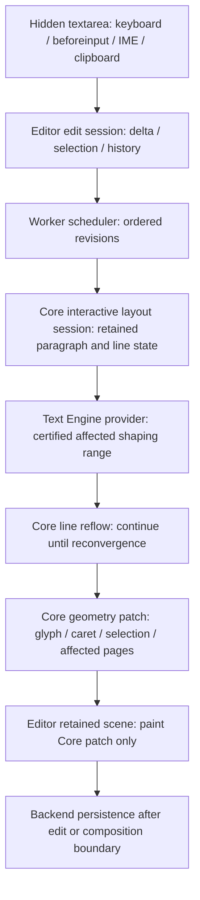

# สถาปัตยกรรมการพิมพ์แบบ Core-authoritative และ Incremental

## Authority Boundary

เจ้าของเอกสาร: `repo-project-control`

ประเภท: Project Control canonical cross-repository architecture specification

Work path: `flowdoc-product-development-resumption > flowdoc-frontend-expert-roadmap`

PLAN task: `01a08a25-13d9-7090-8d91-1c32242988d8`

Active role: `planning-partner` พร้อมหน้าที่ `project-control-steward` และ
`cross-repo-boundary-reviewer`

Phase: `phase-core-text-layout-roadmap`

Checklist: `checklist-core-text-layout-roadmap`

Evidence targets: `evidence-core-incremental-admission` และ
`evidence-preview-keyboard-contract`

เอกสารนี้บันทึกสถาปัตยกรรมที่ตูมยอมรับเมื่อ 2026-09-12 เพื่อใช้เขียนแผนลงมือทำ
และเปิด WORK ที่มีขอบเขตชัดเจน อิง Text Engine ใหม่ของ FlowDoc vNext และเส้นทาง
Creator Preview ปัจจุบัน เอกสารนี้ไม่รับรองว่า incremental shaping/layout พร้อมใช้
ใน production ไม่รับรอง UX หรือ latency และไม่เปลี่ยน DOCUMENT_MAP หรือ system map
Core, Editor และ Backend ยังเป็นเจ้าของ implementation, tests และ runtime behavior
ของตน

## ปัญหาที่ต้องแก้

เมื่อข้อความยาวขึ้น การพิมพ์บนเอกสารตอบสนองช้าลงจนตัวอักษรที่เห็นไม่สัมพันธ์กับ
จังหวะกดแป้น ผลวัดของ Worker candidate แสดง native acknowledgement p95 0.9 ms
แต่ exact Core paper projection p95 1762.2 ms จาก corpus 180 inputs ขณะเดียวกัน
แนวทาง browser-shaped echo ทั้งสามรอบถูกผู้ใช้ปฏิเสธ เพราะการพิมพ์หนึ่งตัวกลางบรรทัด
ทำให้ทั้ง field เปลี่ยนการวาง glyph และการตัดบรรทัดระหว่าง Core กับ browser แล้ว
เปลี่ยนกลับหลัง blur

ปัญหาหลักจึงอยู่ในเส้นทาง shaping → line breaking → geometry → paint ที่ยังทำงาน
กว้างเกินส่วนที่แก้ ไม่ใช่เพียง React, main-thread scheduling, scroll หรือจำนวน Node
จำนวน Node เป็น performance lane แยกต่างหากหลัง active paragraph ผ่านเกณฑ์นี้

## ข้อกำหนด UX ที่ห้ามลด

1. Core เป็น visible layout authority เพียงรายเดียวก่อนพิมพ์ ระหว่างพิมพ์ ระหว่าง
   composition และหลัง blur
2. ตัวอักษร การตัดบรรทัด caret และ selection ที่ผู้ใช้เห็นต้องมาจาก Core revision
   เดียวกัน ห้ามสลับ browser wrapping กับ Core wrapping
3. การพิมพ์ต่อเนื่องต้องไม่ช้าลงตามข้อความหรือเอกสารส่วนที่ไม่ได้รับผลจาก edit
   โดยไม่จำเป็น
4. correctness มาก่อนการคาดเดาขอบเขต หาก Engine พิสูจน์ขอบเขตที่ปลอดภัยไม่ได้
   ต้องประกาศ `full-context-required` และบันทึกความถี่ของ fallback
5. เมื่อ Core ส่งภาพใหม่ไม่ทัน ให้คง exact Core frame เดิมและนับตัวอย่างนั้นเป็น
   latency failure ห้ามเปิด browser text เพื่อกลบความช้า
6. การพิมพ์ภาษาไทยผ่าน IME ต้องใช้ provisional Core edit ระหว่าง composition และ
   commit history เพียงครั้งเดียวเมื่อ composition จบ

## ฐานของ Text Engine ใหม่ที่ใช้ประเมิน

แผนนี้ต่อยอดจาก Core candidate
`4e3b0c9aa4a4d916c78ea5da8e9bac4cffdc4224` และ Editor candidate
`59412e6beb834a96c3c113e03a857de8ffd4efe9` โดยถือข้อเท็จจริงต่อไปนี้เป็นฐาน:

- Creator Preview provider ปัจจุบันเปิดเพียง `shape(text)` และ `segment(text)` จึงยัง
  ไม่มี provider-owned incremental state หรือ certified safe boundary
- terminal-LF experiment ลดงานได้เฉพาะกรณีแคบ และระบุเองว่า full paragraph planning
  shapes ยังคงอยู่ จึงเป็น mechanism evidence ไม่ใช่ general incremental admission
- MR1 range machinery ใช้ full shaping/segmentation oracle และยังไม่ใช่ production
  contract สำหรับเผยแพร่ layout
- Unified Layout Root V2 มีแนวคิด retained/incremental แต่ยังระบุ
  `productionBinding: false`, `mayPublishLayout: false` และ
  `completeNextInputOnHotPath: false`
- Worker candidate ยืนยันว่า engine, session, layout และ geometry อยู่ใน realm เดียวกัน
  ได้ แต่หนึ่ง active synchronous Core computation ยังยกเลิกกลางงานไม่ได้ และผลที่ส่ง
  กลับยังมีขนาดใหญ่

ดังนั้น Text Engine ใหม่มีฐาน shaping และ exact layout ที่ใช้ต่อได้ แต่ความสามารถ
incremental สำหรับ interactive typing ยังเป็นสิ่งที่ต้องพิสูจน์และสร้าง ไม่ใช่สิ่งที่
แผนนี้สมมติว่ามีแล้ว

## สถาปัตยกรรมที่เลือก

เลือกขยาย production Creator path ปัจจุบันด้วย authenticated, provider-owned
incremental text/layout session โดยนำ retained layout และ geometry concepts ที่พิสูจน์
ไว้แล้วมาใช้ภายใต้ production contract ใหม่ ไม่ย้าย Unified Layout Root V2 ทั้งชุดเข้า
production ในรอบแรก และไม่สร้าง Text Engine ใหม่อีกชุดก่อน feasibility gate

### 1. Input adapter — Editor/browser

เก็บ `textarea` ไว้สำหรับ keyboard events, `beforeinput`, IME/composition, clipboard,
focus, accessibility และการเชื่อม selection กับระบบปฏิบัติการ ตัว input ต้องไม่วาด
visible text และต้องวางใกล้ Core caret เพื่อให้ IME candidate window อยู่ในตำแหน่ง
เหมาะสม

### 2. Edit session — Editor

Editor ถือ text value, selection, history และ revision identity พร้อมส่ง edit เป็น delta
เช่น replace range, inserted text, selection after edit และ composition identity แทน
การขอจัดหน้าใหม่จาก complete value อย่างเดียว ระหว่าง composition ใช้ provisional
revisions; `compositionend` จึงสร้าง history commit หนึ่งครั้ง

### 3. Scheduler และ execution realm — Editor Worker

Worker ถือ Core interactive session และ resource identity ใน realm เดียวกัน งานใหม่ต้อง
supersede งานที่ยังไม่เริ่มได้ ส่วนงาน active ต้องถูกแบ่งเป็นขั้นที่ yield/cancel ได้หรือ
สั้นพอจะไม่บัง revision ใหม่ Main thread รับ display DTO/patch เท่านั้นและปฏิเสธ stale
revision

### 4. Interactive layout session — Core

Core เพิ่ม session ที่ถือ immutable input identity และ retained state ของ paragraph,
shaping facts, line membership, page placement และ geometry session ต้องรับ edit delta,
ตรวจ identity/invalidation และตอบได้สองทาง: incremental patch หรือ explicit
`full-context-required` ห้ามใช้ cache ที่ไม่มี source/font/style/profile identity ครบ

### 5. Incremental shaping — Core/Text Engine provider

Provider เป็นผู้ถือ opaque paragraph state และเป็นผู้เลือกขอบเขต shaping ที่ปลอดภัย
เพราะ grapheme, shaping cluster และพยางค์ไทยไม่ใช่สิ่งเดียวกัน Contract ต้องคืน
certificate ที่ Core ตรวจได้ พร้อมเหตุผลเมื่อจำเป็นต้องใช้ full context ห้ามให้ Editor
เดาขอบเขตภาษาเอง

### 6. Line reflow และ reconvergence — Core

เริ่มจัดบรรทัดใหม่จาก certified boundary และเดินต่อจน line state ใหม่กลับมาตรงกับ
retained line state เดิมภายใต้ identity เดียวกัน การแก้บางชนิดอาจกระทบทั้งย่อหน้าหรือ
ไหลไปหน้าถัดไปเพื่อ correctness ได้ แต่ต้องหยุดทันทีเมื่อพิสูจน์ reconvergence แล้ว

### 7. Geometry และ fingerprint — Core

คำนวณ glyph, caret, selection และ page geometry เฉพาะช่วงที่เปลี่ยน พร้อม versioned
patch identity งาน full serialization, UTF-8 materialization และ full-result SHA-256
ต้องออกจาก pre-paint hot path เว้นแต่เป็น gate ที่จำเป็นต่อ correctness

### 8. Retained paint — Editor

Editor เก็บ scene ล่าสุดและใช้ Core patch เปลี่ยนเฉพาะ line/page ที่เกี่ยวข้อง caret และ
selection ต้องผูกกับ patch revision เดียวกัน การ paint ห้าม reshape ข้อความเอง

### 9. Persistence — Backend/Core boundary

Backend transport, save acknowledgement และ durable persistence อยู่นอก key-to-visible
path การ save ใช้ revision/transaction ที่ตกลงภายหลังและไม่บังคับให้ layout รอ network

## ลำดับพิสูจน์และส่งมอบ

### Gate 1 — Core feasibility โดยไม่มี Editor UI

สร้าง executable spike บน Text Engine ใหม่ ครอบคลุม append, backspace, mid-line insert,
selection replacement, Enter และ Thai composition ทุก revision ต้องเท่ากับ full-layout
oracle และต้องรายงาน shaped UTF-16, segmented UTF-16, lines/pages/geometry ที่คำนวณใหม่,
fallback reason และเวลาแยกตาม phase

ผ่านเมื่อ common localized edits ไม่ทำงานตามขนาดของข้อความที่ไม่เกี่ยวข้อง และผล exact
เท่ากับ oracle หาก common typing ยังต้อง full-shape ทั้งย่อหน้าและไม่สามารถเข้าใกล้หนึ่ง
frame บน reference environment ให้คืน `BLOCKER` ที่ Core/Text Engine โดยไม่เปิด Editor
fallback ใหม่

### Gate 2 — Incremental shaping contract

กำหนด provider-owned paragraph state, safe-boundary certificate, invalidation identity,
fallback taxonomy และ oracle verification contract ให้ครบก่อน production binding

### Gate 3 — Incremental line และ geometry patch

เพิ่ม reflow-until-reconvergence, retained page placement และ versioned geometry patch
วัด work amplification และยืนยัน exact parity กับ full layout

### Gate 4 — Editor integration

ให้ Worker เป็นเจ้าของ Core session, ให้ hidden textarea ตาม Core caret, ส่ง delta และ
composition revisions และให้ retained scene วาด Core patches เท่านั้น

### Gate 5 — IME และ UX จริง

ตรวจ Chrome และ Edge บน Windows ด้วย Thai IME จริง รวม candidate-window placement,
composition update/cancel/commit, selection replacement, undo/redo และ stale revision

### Gate 6 — User acceptance

ตูมทดลองข้อความอย่างน้อย 12 บรรทัด ประกอบด้วย soft wrap ผสม Enter, held typing,
backspace, การแทรกอักษรไทยหนึ่งตัวกลางบรรทัด และ blur ต้องไม่มี geometry swap ก่อน
ระหว่าง และหลังพิมพ์ ตัวเลข key-to-visible threshold และ reference environment ต้องตกลง
ใน implementation plan ก่อนเปิด WORK

### Gate 7 — Node-count performance แยกภายหลัง

หลัง active paragraph ผ่าน Gate 6 จึงเปิด lane สำหรับเอกสารประมาณ 30 Nodes ขึ้นไป
รวม pagination, downstream invalidation, viewport/scene retention และ memory pressure
ผลของ lane นี้ห้ามนำมาย้อนอ้างว่า interactive paragraph ผ่านแล้ว

## ทางเลือกที่ไม่เลือก

| ทางเลือก | การตัดสินใจ | เหตุผล |
| --- | --- | --- |
| Browser-shaped visible overlay | ปฏิเสธ | ละเมิด single Core geometry และถูกผู้ใช้ปฏิเสธสามรอบ |
| Productionize Unified Layout Root V2 ทั้งชุดทันที | พักไว้ | ขอบเขตกว้างและ contract ยัง QA-only; ใช้แนวคิดที่พิสูจน์แล้วเป็นส่วนประกอบได้ |
| สร้าง Text Engine ใหม่อีกชุด | ยังไม่ทำ | ต้องพิสูจน์ก่อนว่าส่วนประกอบ vNext ปัจจุบันไม่สามารถรองรับ contract ที่ต้องการ |
| แก้เฉพาะ Worker/React scheduling | ไม่เพียงพอ | ย้ายงานออกจาก main thread ได้ แต่ไม่ลด shaping/layout work และไม่ทำให้ exact paper ทัน input |

## Model decision สำหรับ WORK

- PLAN และ Core feasibility/contract รอบแรกใช้ `gpt-6-astra` effort `high` เพราะเป็น
  cross-boundary architecture ที่มีความไม่แน่นอนสูงและเคยล้มเหลวหลายแนวทาง
- หลัง contract ชัดเจน ให้ประเมิน Core implementation ใหม่ระหว่าง Astra กับ
  `gpt-5.6-sol` effort `high` ตามขนาดและความเสี่ยงจริง
- Editor integration และ measurement เริ่มประเมินด้วย Sol high ได้ หาก Core contract
  ปิดความกำกวมแล้ว
- ทุก WORK ต้องบันทึก model, effort, เหตุผลเฉพาะงาน, availability source, ตัวเลือกที่
  เบากว่า และ escalation trigger ห้ามรับ model ของ PLAN ไปโดยอัตโนมัติ

## Risks และ unknown state

- การแทรกภาษาไทยอาจเปลี่ยน shaping หรือ break opportunity ก่อนจุดแก้
- ยังไม่ทราบว่า Rust/WASM provider ปัจจุบันสร้าง safe-boundary certificate ที่น่าเชื่อถือ
  ได้หรือไม่
- ยังไม่ทราบความถี่ของ `full-context-required` บนข้อความจริง
- ยังไม่กำหนด interaction snapshot และ patch wire contract ขั้นสุดท้าย
- Worker ปัจจุบันยกเลิก active synchronous Core computation กลางงานไม่ได้
- OS IME candidate-window behavior ยังไม่ได้ยืนยันด้วย Thai IME จริง
- ค่า latency ที่ทำได้บน reference hardware ยังไม่ทราบจน Gate 1
- downstream pagination และ Node จำนวนมากยังอยู่นอกขอบเขตการรับรอบแรก

## Evidence anchors และสถานะ

- `evidence-core-incremental-admission`: bounded terminal-LF reuse และ cost attribution;
  ไม่ใช่ full incremental admission
- `evidence-preview-keyboard-contract`: Worker timing และการปฏิเสธ browser-shaped echo
  จาก actual user trials
- Core source pin: `4e3b0c9aa4a4d916c78ea5da8e9bac4cffdc4224`
- Editor source pin: `59412e6beb834a96c3c113e03a857de8ffd4efe9`
- Rejected candidates ต้องเก็บไว้เพื่อ evidence/reconciliation; ห้าม merge หรือ cleanup
  จากการอนุมัติสถาปัตยกรรมนี้
- ไม่มี product change, dispatch, map promotion หรือ production acceptance จากเอกสารนี้

## ขั้นต่อไปหลังอนุมัติเอกสาร

เมื่อผู้ใช้ตรวจและยอมรับเอกสารฉบับนี้ PLAN จึงเขียน implementation plan ที่ระบุไฟล์,
contract, tests, measurement corpus, reference environment, Kickoff Packet, model decision
และ Return Channel ของ Core feasibility WORK จากนั้นจึงขออนุมัติแผนก่อน dispatch
Editor WORK ต้องรอ Core Gate 1 ผ่านและได้รับการยอมรับจาก PLAN
