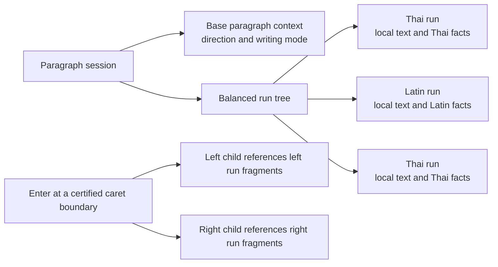

# FlowDoc Core Run-Owned Property Gate 2 Design

## Authority Boundary

Owner: `repo-project-control`

Work path: `flowdoc-frontend-expert-roadmap`

Active roles: `planning-partner`, `project-control-steward`, and
`cross-repo-boundary-reviewer`

Phase: `phase-core-text-layout-roadmap`

Current checklist boundary:
`incremental-boundary-rust-session-feasibility` is `blocked`

Starting evidence: `evidence-core-rust-paragraph-session-feasibility`

This document records the user-selected redesign direction after the Gate 2B
BLOCKER. It is a Project Control architecture decision and review draft. Core
owns any later implementation and tests. It does not authorize a Core edit,
new WORK room, Gate 3, Editor work, public exports, production binding, or map
promotion until the user reviews this document and a later plan is approved.

## Problem Being Solved

The retained Gate 2B candidate correctly owns a paragraph in Rust, supports
bounded middle edits, and can split an Enter operation when both resulting
paragraphs keep the same properties. It fails when the right child begins with
Latin text after a Thai parent prefix. Its one paragraph-wide script property
changes from Thai to Latin, which invalidates raw Thai glyph facts far from the
caret. The measured exact fallback shapes and segments the full 2,688 UTF-16
child, exceeding the fixed Gate limits.

The redesign treats this as a property-ownership error, not as a tree or
copying problem: script and local shaping facts must belong to text runs, while
paragraph-wide direction remains separate.

## User-Visible Contract

The user sees a normal text editor. Enter, typing, deletion, and composition
must present one exact result for the completed operation. A child paragraph
must not temporarily show the parent script or rewrap later while an internal
calculation catches up.

The private feasibility layer may return a typed, non-publishing fallback when
it cannot prove the fixed work bound. That result is evidence only; it is not a
production UX design or permission to show provisional browser text.

## Proposed Ownership Model

The Rust paragraph session remains the only mutable authority. TypeScript
keeps opaque private QA receipts and never duplicates mutable source, run
state, or raw glyph facts.

`BaseParagraphContext` contains only facts that truly apply to the whole
paragraph, initially direction and writing mode. A first-strong character may
participate in resolving base direction, but it must not assign one script to
every run in the paragraph.

Each `Run` owns:

- an immutable local source slice and UTF-16 range;
- a local property key: script, language, direction where applicable, font and
  shaping features;
- raw glyph and break facts certified for that local property key;
- local boundary certificates for the facts that may be shared after a split;
- references into the balanced tree rather than a copied paragraph string.

A run is not a word. It is a maximal local region whose property key is the
same, subject to safe Unicode boundaries and bounded leaf sizes.

## Enter and Arbitrary Caret Positions

An Enter command first validates the supplied caret as a Unicode scalar and
grapheme-safe boundary. It may split a word or a one-character run fragment;
it must not split a Thai base character from its combining marks or split an
active composition.

For `off|ice`, both child fragments keep the Latin property key and can share
their immutable source payload. Facts close to the new end and start are
re-certified because ligatures and contextual shaping may change there. Facts
outside the certified seam remain shared.

For a mixed child such as `office AV กิ้ กำ น้ำ`, the Latin and Thai runs move
to the right child as separate run references. The right child starting with
Latin must not relabel the later Thai run as Latin. Thus its Thai facts remain
valid unless a proven local boundary dependency requires repair.

Repeated Enter operations may create many fragments. The balanced run tree
path-copies only the affected descriptors, keeps height bounded, and merges
adjacent fragments with identical property keys when that merge is itself
within the operation budget. It does not use hidden whole-paragraph compaction.

## Seam Certificate

The implementation must not assume that shaping is local merely because a
sample looks local. For each new child seam, Core must produce a certificate
that identifies a bounded left and right repair context and proves no raw fact
outside that context changes under the run property key.

The certificate must cover shaping, segmentation, glyph clusters, unsafe-break
facts, direction-sensitive behavior, and the run-property boundary. If the
certificate cannot close within 512 UTF-16 units per source/fact window and
1,024 UTF-16 units of combined shape plus segment input, the command returns a
typed non-publishing fallback. It leaves the original revision and receipts
unchanged. A future production path is not authorized until the relevant
corpus demonstrates that normal user operations receive an exact bounded path.

## Required Semantic Proof Before Implementation

The existing full oracle applies one script to a whole paragraph. This design
changes the internal property model, so Core must first prove one of these
claims before it treats run facts as exact:

1. run-owned shaping is byte-for-byte or fact-for-fact equivalent to the
   product's required mixed-script behavior; or
2. Core explicitly adopts run-owned shaping as the product semantic contract,
   with reviewed fixtures that define the intended result.

This is a Core semantic decision. Project Control may record the decision and
evidence, but must not declare visual equivalence from this design alone.

## Feasibility Stages

1. **Semantic characterization.** Compare the current full oracle, a
   run-owned reference oracle, and representative Thai, Latin, mixed, ligature,
   combining-mark, direction, and composition fixtures. Classify every
   difference as expected semantic change, defect, or unresolved.
2. **Cold construction.** Build a run tree and local facts in Rust at session
   creation. Account for all cold traversal, shaping, segmentation, memory and
   ABI work; do not retain a second mutable contiguous authority.
3. **Ordinary edits.** Prove append, backspace, middle insert, replacement and
   composition update at run boundaries and inside a run. Include word cuts,
   character cuts, Thai grapheme boundaries, and rejected unsafe boundaries.
4. **Structural edits.** Prove head, middle and tail Enter, including a
   child whose first strong character changes. Require atomic publication of
   both children or a non-publishing fallback.
5. **Recovery and admission.** Cover missing anchors, eviction, disposal,
   cancellation, RTL and the fixed 180-revision corpus. Apply the unchanged
   p95, maximum, scaling, window and cumulative-work limits only after stages
   1-4 are exact.

Each stage is a stop gate. A failed stage returns evidence and an updated
design; it does not advance to the next stage or relax the limits.

## Fixed Boundaries

The following remain unchanged:

- p95 at most 8 ms, maximum at most 16.7 ms, and 8,192-to-256 scaling at most
  1.50;
- source/fact windows at most 512 UTF-16 and combined shaping plus segmentation
  input at most 1,024 UTF-16;
- one Rust-owned mutable session; private QA-only ABI; atomic revision
  publication; exact independent oracle; complete cumulative-work accounting;
- no Gate 3 geometry, Editor, Backend, public exports, production binding,
  Node-count claim, threshold change, or map promotion.

## Alternatives Retained for Comparison

Property variants cached per chunk may reduce a property-changing Enter to a
lookup, but its cold cost and memory growth are unproved. A property dependency
map can diagnose exactly which facts change, but the Gate 2B evidence shows it
may still span a whole child. Both remain supporting alternatives, not the
selected ownership model.

## Open Risks

- Complex OpenType lookups, ligatures, bidi transitions, language-specific
  shaping and font features may prevent a small seam certificate.
- Base-direction changes, RTL, empty child publication, no-anchor recovery,
  composition and cancellation are unproved.
- Rustybuzz/ICU internal allocations, reference destruction, local rescans and
  host/WASM glue must be accounted for before performance admission.

## Review Decision Needed

After user review, the next plan should open a Core-only read-only semantic
characterization lane first. It must compare run-owned behavior with the
required product behavior before any implementation worktree is authorized.
