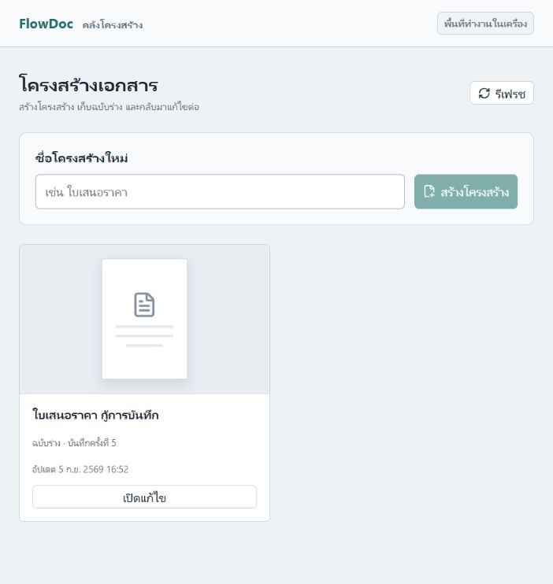
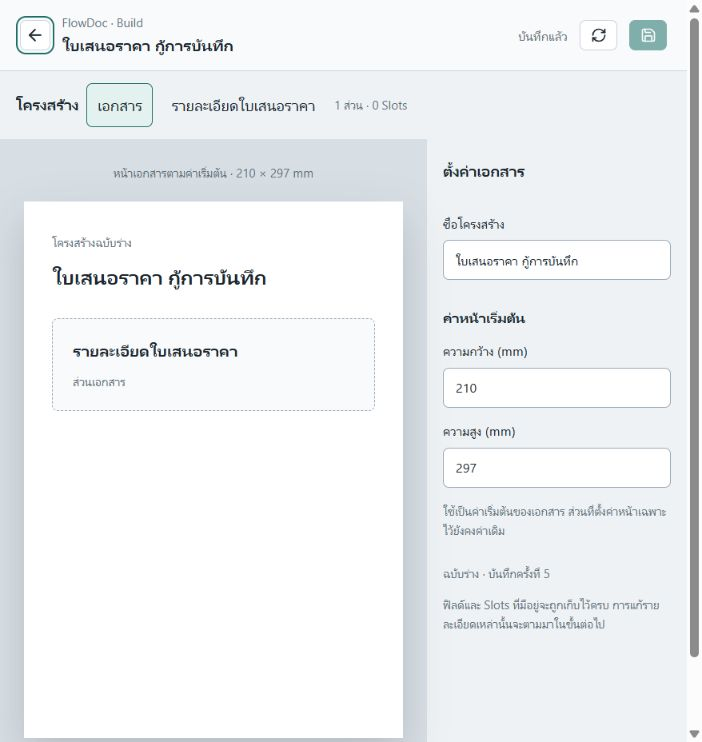
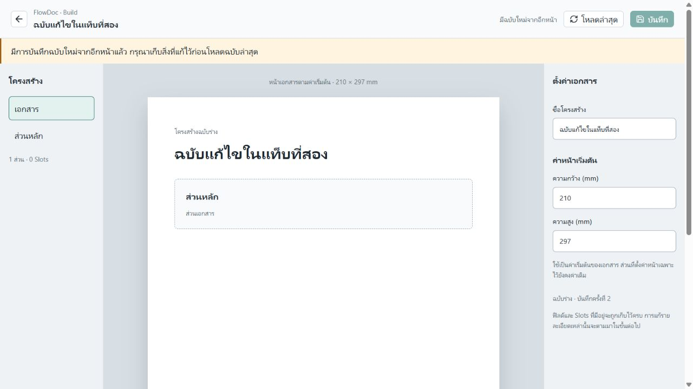

# เริ่มส่งมอบคลังโครงสร้างและฉบับร่าง — R0–R2

## Authority Boundary

Owner: `repo-project-control`; Work path: `flowdoc-product-development-resumption > flowdoc-frontend-expert-roadmap`.
Active role: Planning Partner / Cross-Repo Boundary Reviewer สำหรับ R0; Product Implementation Agent ทำงานแต่ละ repo ตามขอบเขตด้านล่าง; Project Control Steward บันทึกผลหลังตรวจ
Phase targets: `phase-creator-draft-r0`, `phase-creator-draft-r1`, `phase-creator-draft-r2`.
Checklist targets: `checklist-creator-draft-r0`, `checklist-creator-draft-r1`, `checklist-creator-draft-r2`.
Evidence targets: `evidence-creator-draft-r0-2026-09-05`, `evidence-creator-draft-r1-2026-09-05`, `evidence-creator-draft-r2-2026-09-05`.

อ้าง [roadmap ปัจจุบัน](flowdoc-frontend-expert-roadmap-2026-09-03.md), [Creator UX Contract](flowdoc-creator-ux-contract-v0-2026-09-04.md) และ [Backend HTTP acceptance](flowdoc-backend-document-structure-http-boundary-v0-acceptance-2026-09-04.md).
นี่คือขอบเขตเริ่มงานตามคำสั่งตูม ไม่ใช่หลักฐานว่าส่งมอบ R1–R2 แล้ว ไม่เปิด WORK rooms หรือ dispatch set; ทำงานเรียงลำดับใน task นี้ด้วย worktree ของแต่ละเจ้าของ ไม่มี map truth promotion

## R0: ต้นทางข้อมูลและขอบเขตการเชื่อม

เลือกให้ DocumentDefinition draft จาก Backend เป็นข้อมูลต้นทางของ creator Build ชุดนี้ และใช้การแสดงโครงสร้างจาก draft โดยตรง ไม่มีการแปลง Document Package กลับเป็น draft หรือบันทึกสองระบบพร้อมกัน

เหตุผล: Editor `493fd8c90fdc2283e7cc2d0f18436a671a60b952` ใช้ `coreReadTransport.ts` ซึ่งต้องมี packageValue แต่ Backend `eddf727fabef035862c91d3af9eb04b884c8ac6d` มี DefinitionDraftInput ที่ไม่มี payload เนื้อหา Text/Table ของ Package ครบถ้วน การสร้าง Package เพื่อให้หน้าปัจจุบันเปิดได้จะเป็นสัญญาใหม่ที่ต้องพิสูจน์ด้าน Core เพิ่ม

ทางเลือกที่พิจารณา: (1) แปลง Package สองทิศทาง — ยังพิสูจน์การเก็บข้อมูลครบไม่ได้; (2) บันทึกทั้ง Package และ draft — เพิ่มปัญหาสอง revision และ transaction ข้ามแบบข้อมูล; (3) ใช้ draft โดยตรง — เลือกทางนี้สำหรับ R2 ที่จำกัดการแก้ไขชื่อและค่าหน้า ใช้ shell/style ที่ไม่ผูกกับ Package ได้ แต่ไม่อ้าง renderer parity

| ข้อมูล | วิธีใช้ในรอบแรก |
| --- | --- |
| definition.id | ID ของรายการในคลังโครงสร้างและ URL ใหม่ `/structures/:definitionId/build`; ไม่ใช้แทน documentId ของ `/documents` |
| definition.workspaceId | `workspace:local` สำหรับ creator local workspace; list filter ไม่ใช่ระบบสิทธิ์ |
| draft.id | ID คงเดิมเมื่อบันทึก; ไม่ใช้เป็น Package/schema version |
| revision | Backend draft revision; ส่งเป็น baseRevision ทุกครั้ง สร้างครั้งแรกใช้ 0 |
| title และ page defaults | ค่าที่แก้ได้ใน R2; แสดงพื้นที่หน้าเป็นโครงสร้าง ไม่ใช่ผล PDF |
| sections | แสดง outline และชื่อ; เก็บทุก section, parent และ page/style fields ครบเมื่อบันทึก |
| componentDefinitions / componentInstances | wire names ตาม Backend เดิม; ใน UI เรียก Structure Patterns / Slots และเก็บข้อมูลเดิมทั้งหมด ห้ามเปลี่ยนเป็น runtime Entries |
| fieldBindingExpectations | เก็บครบ แม้ UI รอบแรกยังไม่แก้ไข |
| createdAt / updatedAt / revision | อ่านจาก Backend; ไม่ส่งเป็นส่วน draft input ที่ strict schema ไม่รับ |

Library creator ใช้ `/structures`; `/documents` และ URL เอกสารเดิมใน vNext ยังคงอ่านผ่านเส้นทาง Package เดิมโดยไม่ย้ายข้อมูลอัตโนมัติ หน้าแรกเมื่อ R2 พร้อมให้เข้าคลังโครงสร้างใหม่ ไม่อาศัย `FlowDocEditor` ที่เลิกใช้งาน

### หลักฐานทดลอง R0

เรียก route handler โดยตรงใน in-memory repository แยก เมื่อ 2026-09-05 ด้วย Backend commit ข้างต้น:

```json
{"definition":{"id":"document-definition:r0-probe","workspaceId":"workspace:local","title":"R0 draft","status":"draft"},"draft":{"id":"document-draft:r0-probe","defaultOrientation":"portrait","defaultPageHeight":297,"defaultPageUnit":"mm","defaultPageWidth":210},"sections":[{"id":"section:r0-main","orientation":"portrait","pageHeight":297,"pageUnit":"mm","pageWidth":210,"parentDraftSectionId":null,"sectionKey":"main","sectionKindKey":"flow-section","sortOrder":0,"styleDefaults":{},"title":"Main"}],"componentDefinitions":[],"componentInstances":[],"fieldBindingExpectations":[]}
```

ส่ง payload นี้เป็น `{baseRevision:0,draft:payload}` ให้ POST `/document-structures/drafts`: ผล 200 saved revision 1; GET `/document-structures/drafts/document-definition%3Ar0-probe`: ข้อมูลตรงทุกฟิลด์พร้อม timestamps/revision; แก้ชื่อด้วย baseRevision 1 ได้ revision 2; ส่ง revision 1 ซ้ำได้ 409 stale และอ่านกลับยังเป็นชื่อใหม่ `R0 edited`
นี่พิสูจน์เฉพาะการรับข้อมูลขั้นต่ำและ revision gate ผ่าน handler ไม่ใช่ browser integration, HTTP server restart หรือการแปลง Package

## R1: Backend — คลังและ local persistence

เพิ่ม GET `/document-structures/definitions?workspaceId=workspace%3Alocal&limit=24&cursor=...` คืน items ที่มี definitionId, draftId, title, status, revision, updatedAt และ nextCursor; เรียง definitionId แบบคงที่เพื่อไม่ให้การแก้ชื่อระหว่างเปิดหน้าทำรายการกระโดด ใช้ cursor ผูก workspace ตรวจ limit 1–100 และคำขอผิดรูปแบบ

ต่อ SQLite ที่มีอยู่กับ local server: path ตั้งด้วย `FLOWDOC_DOCUMENT_STRUCTURE_DB_PATH` โดยค่าเริ่มต้นอยู่ `.local/document-structure.sqlite` ของ Backend; seed masters, สร้าง parent directory, ปิด connection เมื่อ server ปิด ไม่มี silent fallback ไป memory เมื่อเปิดฐานไม่ได้ ขอบเขตนี้ไม่เปลี่ยน Package seed repository และไม่ใช่ production database/authentication

ตรวจด้วย test ก่อน implementation: list แยก workspace/แบ่งหน้า/เรียงเสถียร ทั้ง memory และ SQLite; HTTP malformed query; process restart ใช้ไฟล์เดิมแล้ว draft และรายการยังอยู่; รวม existing stale/racing save guards และ full Backend gate

## R2: Editor — เส้นทางผู้ใช้ขั้นต่ำ

เพิ่ม transport และ runtime สำหรับ draft โดยไม่ import Backend source เข้าหน้าบ้าน; ข้อมูล response ต้องตรวจรูปแบบก่อนใช้ UI มีคลังโครงสร้าง สร้างโครงสร้าง ตั้งชื่อหน้า/ชื่อเอกสารและค่าหน้า บันทึก กลับคลัง เปิดกลับ และ reload ข้อมูลจาก Backend

ใช้ crypto-generated IDs; สร้างหนึ่ง flow-section A4 กับ arrays ว่างตาม payload ที่ทดลองได้ การแก้ค่าหน้า default ไม่เขียนทับค่าหน้าเฉพาะ section โดยเงียบ ๆ แสดง scope ชัดเจน

ส่ง draft input ทั้งก้อนจากข้อมูลที่อ่านไว้ โดยเปลี่ยนเฉพาะ field ที่ UI รองรับ เก็บ arrays/unknown styleDefaults ที่รองรับโดยสัญญาให้ครบ; read model และ input parser ต้องไม่ทิ้ง fields ที่ UI ยังไม่แสดง ไม่มี localStorage/sessionStorage เป็น canonical persistence

มี dirty/saving/saved/error/conflict state; ป้องกัน response ของเอกสารหรือคำขอเก่าทับ state ใหม่ บันทึกล้มเหลวคง draft ในหน้า ขัดแย้งแจ้งว่าต้องโหลดฉบับล่าสุดก่อนบันทึกใหม่และเตือนก่อนทิ้งสิ่งที่แก้; บันทึกสำเร็จยึด revision ที่ Backend คืน

ยังไม่เปิด Preview, Versions, Published/API หรือ renderer pipeline จาก draft นี้ แสดงเหตุผลที่เกี่ยวกับความสามารถจริง ไม่เอา Package version มาแสดงเป็น draft version

เกณฑ์ผ่าน: transport/runtime tests, preserve unsupported fields, keyboard และจอแคบ, browser create/edit/save/reload, กลับ Library, server restart, สองแท็บแก้ revision เดียวกัน; full Editor และ Project Control gates

## ความเสี่ยงและงานที่ยังไม่รวม

Core Slot facts validator เป็นขอบเขต semantic ไม่ใช่ draft-to-Package compiler; Core main ที่อ่านได้จริงคือ `e3b9888b25fe963ef4316fe8066d086bae55db47` ไม่ใช้ full SHA ที่คลาดเคลื่อนใน acceptance เก่าเพื่ออ้างความพร้อม ไม่แก้ Core รอบนี้

การแก้ fields/Slots จริง, หน้าจำลองข้อมูล, Version listing, publication data contract และ PDF อยู่ R3–R7 ตาม roadmap การส่งมอบ R2 เป็นฐาน draft authoring ที่จำกัด ไม่ใช่การปิดงาน Build ทั้งหมด

## ผลส่งมอบและการรับงาน 5 กันยายน 2026

รับ R0–R2 เฉพาะวงจรสร้าง → แก้ฉบับร่าง → บันทึก → เปิดต่อ ใน local workspace ตาม `phase-creator-draft-r0/r1/r2`, `checklist-creator-draft-r0/r1/r2` และ Evidence `evidence-creator-draft-r0/r1/r2-2026-09-05` ภายใต้ Work เดิม ไม่มีการ dispatch WORK rooms รอบนี้

- Backend main `a639dadb82d674360992ce085960989bc9cf2656`: type-check, tests 354 passed / 27 skipped (95 passed / 1 skipped files), build ผ่านทั้ง worktree และ main ใช้ `--maxWorkers=1` หลัง default worker จบผิดปกติ; รันครบทุก test ใหม่ ไม่ลดรายการทดสอบ
- Editor main `8e29b711405916491a9efbaa3db2361175075519`: `npm run check` ผ่านทั้ง worktree และ main รวม 113 files / 412 tests, type-check และ build มีคำเตือน bundle ขนาดใหญ่
- Browser บน main: สร้าง ตั้งชื่อ แก้ชื่อส่วน บันทึก กลับ Library เปิดใหม่ และ reload; สองแท็บ stale revision ได้ conflict โดยเก็บข้อความแก้ไว้; หยุด Backend แล้ว save ล้มเหลวไม่ทิ้งข้อความ เริ่มใหม่ด้วย SQLite เดิมและบันทึกซ้ำได้ revision 5 อ่านกลับถูกต้อง
- Keyboard Tab เข้าปุ่มกลับคลังและ Enter กลับได้; ตรวจ layout ที่ 702 และ 1280 px หน้าจอเล็กกว่า 700 px ยังไม่ยืนยัน เพราะ host ไม่ปรับ viewport ตามคำขอ ไม่อ้าง mobile QA ครบ
- ก่อนปิดรอบต้องผ่าน Project Control `npm run check` ทั้ง worktree และ main; ไม่มี system map / DOCUMENT_MAP / Node truth เปลี่ยน





### RISK: dependency ของ Core ในเครื่อง

ตรวจ Core HEAD `e3b9888b25fe963ef4316fe8066d086bae55db47` พบ tracked files ถูกลบ 59 ไฟล์ใน `packages/text-engine-rust-wasm` โดยยังไม่ทราบต้นเหตุ ไม่ restore หรือแก้ canonical Core รอบนี้ เพื่อรักษางานที่ไม่ทราบเจ้าของ

Editor gate และ preview ใช้สำเนา package, root tsconfig และ Sarabun fonts ที่ดึงจาก Git commit ข้างต้นไว้แยกใน `C:/Users/nekot/.codex/visualizations/2026/09/05/01a0707e-00e9-74e1-be1b-a272a1b89d2a/core-wasm-baseline` แล้วเปลี่ยน local dependency junction ไปสำเนานี้ เก็บ junction เดิมเป็น `text-engine-rust-wasm.original-link` การตั้งค่านี้ไม่ใช่ source patch และ `npm ci` ใหม่จะกลับไปหา canonical Core ที่ยังขาดไฟล์ จึงยังอ้าง clean-install readiness ไม่ได้ ต้องตรวจเจ้าของและ reconcile Core แยกก่อนพัฒนางานที่พึ่ง renderer

### งานถัดไป

R3: จัดการ sections, fields, Structure Patterns และ Slots โดยใช้ draft contract นี้และรักษาข้อมูลที่ UI ยังไม่แก้ การเชื่อม Package rendering, Preview, Versions, publication และ PDF ยังไม่รวม ไม่อ้างว่า Build ครบทุกความสามารถหรือพร้อม production
