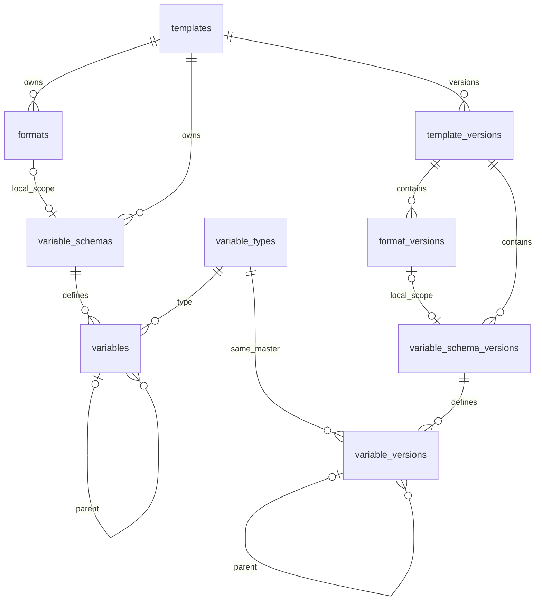

# Export MVP — ข้อมูลปัจจุบันและชุดเวอร์ชัน

## Authority Boundary

Owner: Project Control. Role: Planning Partner / Documentation Synthesizer.
Status: บันทึกข้อตกลงเจ้าของและร่างแบบเพื่ออ่านทบทวน วันที่ 2026-10-08;
ยังไม่ใช่ implementation plan หรือหลักฐานว่าฐานข้อมูลเปลี่ยนแล้ว
Authority: เจ้าของสั่งเก็บเอกสารหลังตกลงเรื่อง current/version, ตัวแปร และ master
ในแชตนี้ งานเอกสาร inline; Work/Phase/Checklist/execution IDs ไม่เกี่ยวข้อง
Work size: small documentation task; risk: routine. ใช้ checkout ปัจจุบันที่สะอาด
ไม่มี separate WORK หรือการเปิด execution เก่าใหม่

ขอบเขต: บันทึกแบบก่อน R4; ไม่แก้ Service/Core/DB, ไม่ออก migration หรือ API
เจ้าของ implementation ภายหลังคือ Service; Core เป็นเจ้าของสัญญา template/type
Document budget: เอกสารนี้หนึ่งฉบับและลิงก์สถานะใน MVP/R1/R3 เท่านั้น
Proof budget: เทียบข้อตกลงกับ R1/R3 และ SQL ปัจจุบัน, self-review, ตรวจลิงก์/
Authority Boundary/diff; ไม่ทดสอบ runtime ซ้ำเพราะไม่มี product change
Acceptance: แยกสิ่งที่ตกลงแล้วกับข้อเสนอ, ระบุ ref/clone/deletion/version lifecycle,
บอกความต่างจาก R3 และสิ่งที่ยังต้องตัดสินใจก่อน implementation

แหล่งอ้างอิง:
- [MVP ที่ล็อกไว้](flowdoc-export-mvp-v1-2026-10-07.md)
- [R1 contract](flowdoc-export-mvp-r1-design-2026-10-07.md)
- [R3 implementation และผลตรวจ](flowdoc-export-mvp-r3-registry-plan-2026-10-07.md)

Generated current snapshot ยังกล่าวถึงงาน Editor รุ่นก่อน; ไม่ใช้เป็น authority
ของคำขอใหม่นี้ ใช้คำขอเจ้าของกับเอกสาร Export MVP โดยไม่แก้ registry/map อื่น
R3 commit `da79f00` ผ่านตามขอบเขตเดิมแล้ว ไม่เปลี่ยนผลย้อนหลังให้เป็น failed
แบบใหม่นี้เป็น owner-authorized design revision ต่อข้อจำกัดสี่ตารางเดิม;
implementation ยังต้องมีแผนและหลักฐานของตัวเองก่อนถือว่าใช้แทนได้

## 1. ข้อตกลงที่ยืนยันแล้ว

1. ไม่มีหน้าบ้าน/ฟอร์มในรอบนี้ “สร้างเวอร์ชัน” หมายถึงคำสั่งฝั่งหลังบ้าน
   เรากับเจ้าของเป็นผู้เตรียมข้อมูล ไม่เพิ่มระบบ permission หรือผู้สร้างรายคน
2. ตารางปกติเป็นข้อมูลปัจจุบันที่แก้ได้เสมอ ตารางเวอร์ชันเป็นอีกชุดแยกกัน
   ข้อมูลในรายการเวอร์ชันเก็บเป็น JSON snapshot ได้ ไม่บังคับแตกทุก node
3. เริ่มจาก ID โครงเอกสาร โหลดส่วนประกอบที่เป็นของมัน ตรวจพื้นฐาน แล้ว clone
   ไปชุดเวอร์ชัน; มี ref กลับ ID โครงเอกสารเพื่อระบุต้นทาง ไม่ใช้ดึงค่าปัจจุบัน
4. เลขเวอร์ชันเรียงแยกต่อโครง: ไม่มีเริ่ม 1; มีแล้วใช้ล่าสุด +1
   รายการที่ clone ได้ ID ใหม่ และเปลี่ยน ref ภายในให้ชี้ชุดใหม่
   master ใช้ ID เดิม; รูปแบบย่อยไม่มีวงจรออกเวอร์ชันอิสระจากโครงหลัก
5. `variable_schemas` เป็นชุดเจ้าของ; `variables` เก็บนิยามรายตัว
   แต่ละตัวมี ID ของตัวเองและ key ซึ่งคือชื่อตัวแปร ไม่ใช่ ID หรือ type code
   key ซ้ำคนละชุด/คนละแม่ได้ แต่ห้ามซ้ำในขอบเขตเดียวกัน
6. ลูกของ object/รายการใช้ `parent_variable_id` และอยู่ชุดเดียวกับแม่
   ไม่วนวงจร; รูปแบบย่อยซ้ำหลาย invocation ใช้นิยามร่วมแต่ค่าคนละชุด
7. ตารางเอกสารมีโครงคอลัมน์คงที่ในเวอร์ชัน แถวเพิ่มตาม array<object>
   นิยามข้อมูลกับหน้าตา/หัวคอลัมน์อยู่คนละส่วน ไม่เพิ่มคอลัมน์จาก request
8. เปลี่ยนชื่อตัวแปรใช้ ID เดิม; ลบในชุดปัจจุบันได้ ไม่กระทบชุดเวอร์ชันเก่า
   ถ้ายังมีจุดอ้างค้าง ต้องแก้ให้ validate ผ่านก่อนสร้างเวอร์ชันใหม่
9. master ประเภทตัวแปรใช้ INTEGER ID หกหลักโดยตรง: สองหลักหน้า `11`
   สี่หลักท้ายเป็นรายการ ไม่มี UUID หรือ ref_code ซ้อนสำหรับ master นี้
   `variables.type_id` อ้าง ID ดังกล่าว ส่วน code/name เป็นคนละหน้าที่
10. ทุกตารางมี created_at; ตารางปัจจุบันที่แก้ไขได้มี updated_at
    เวลาของแถวเวอร์ชันหมายถึงเวลาที่สร้าง snapshot ไม่คัดเวลาต้นทางมาสวม
11. สร้างเวอร์ชันแบบครบชุดหรือไม่บันทึกเลย; คำขอเดิมที่ retry คืนเวอร์ชันเดิม
    snapshot ที่บันทึกต้องตรงกับชุดข้อมูลที่ตรวจผ่าน ไม่ถูกแก้แทรกระหว่างทาง

นอกขอบเขต: permission/created_by, media library, frontend, node master,
node tree table, arbitrary nested formats, DOCX, queue/load scaling และ R4 code

## 2. คำที่ใช้ในแบบนี้

Disposition: define/split เฉพาะ Export MVP; ไม่เปลี่ยน global glossary
- Template/โครงหลัก: ตัวตนโครงเอกสารที่ docKey อ้างถึง
- Format/รูปแบบย่อย: ส่วนประกอบที่ผู้สร้างโครงกำหนด ไม่ใช่ชนิดไฟล์หรือ node type
- Variable schema/ชุดนิยาม: ขอบเขตเจ้าของนิยาม ไม่ใช่ค่าที่ส่งมาสร้างเอกสาร
- Variable: นิยามหนึ่งฟิลด์; array หลายแถวไม่ทำให้เพิ่มนิยามตามจำนวนแถว
- Source ref: บอกที่มา; Version ref: เชื่อมข้อมูลภายในฉบับที่ล็อก
- Snapshot: สำเนาข้อมูล ณ เวลาเก็บเวอร์ชัน ไม่ใช่ pointer ไปอ่านข้อมูลปัจจุบัน

## 3. ร่างตารางและความสัมพันธ์

ชื่อคอลัมน์ต่อไปนี้เป็น **ข้อเสนอทางเทคนิคเพื่อทบทวน** ไม่ใช่ SQL ที่มีแล้ว
ID ของ entity ใหม่เสนอ UUID v7; master เป็น INTEGER ตามข้อยืนยัน
เก็บเวลาที่มีเขตเวลา; กำหนด created_at ฝั่ง DB และอัปเดต updated_at ทุก mutation

| ตารางปัจจุบัน | ฟิลด์/หน้าที่หลักที่เสนอ |
| --- | --- |
| templates | id, doc_key, name, structure_json: โครงหลัก/settings/styles/examples ที่ตนเป็นเจ้าของ |
| formats | id, template_id, key, position, structure_json: fragment ของรูปแบบย่อย |
| variable_schemas | id, template_id, format_id nullable: null คือชุดหลัก มิฉะนั้นเป็นชุดของ format |
| variables | id, schema_id, parent_variable_id nullable, key, type_id, position, definition_json |
| variable_types | id, code unique, name; ทะเบียนประเภทที่ Core รองรับและมีความหมายคงที่ |

`definition_json` เก็บข้อกำหนดเช่น required/default/allowEmpty/label/description
ไม่เก็บ id/schema_id/parent/key/type ซ้ำเป็น authority อีกชุด
ไม่มี default กับ default ที่ส่งมาเป็น null ต้องแยกกันได้ ไม่สร้างค่าทดแทนอัตโนมัติ
ข้อมูล structure_json ไม่เก็บสำเนา formats/globalSchema เต็มซ้ำกับตารางเจ้าของ
Service ประกอบ envelope ให้ Core เมื่อต้องใช้ ไม่ทำให้ Core รู้จักรายละเอียด SQL

| ตารางเวอร์ชัน | ฟิลด์/หน้าที่หลักที่เสนอ |
| --- | --- |
| template_versions | id ใหม่, template_id ต้นทาง, version, snapshot_json ของส่วนโครงหลัก, fingerprint ของ envelope ที่ประกอบแล้ว |
| format_versions | id ใหม่, template_version_id, source_format_id, snapshot_json ของ format/key/position |
| variable_schema_versions | id ใหม่, template_version_id, format_version_id nullable, source_schema_id, snapshot_json ของ metadata ชุด |
| variable_versions | id ใหม่, schema_version_id, parent_variable_version_id nullable, source_variable_id, type_id เดิม, snapshot_json ของ key/position/ข้อกำหนด |

ทุกตารางเวอร์ชันมี created_at และ immutable; ไม่ต้องคัดเลข version ลงลูกทุกแถว
ลูกไล่ ref หา template_versions ที่เป็นฉบับเดียวกันได้ ตาราง snapshot_json เป็น
JSONB ตาม storage เดิม ไม่ใช้ TEXT เพื่อแก้ปัญหา serialization ที่ยังไม่พบในระบบนี้
source_*_id ของรายการลูกเป็น provenance ที่คงอยู่แม้ต้นทางถูกลบ ไม่ใช้ FK
แบบ cascade/restrict ที่ขัดกับการลบข้อมูลปัจจุบันได้; ห้ามใช้ source ref โหลดเนื้อหา
template_id ระดับหลักยังอ้างตัวตนเอกสารที่เก็บไว้ การลบโครงทั้งรายการเสนอให้
restrict เมื่อมีเวอร์ชัน ไม่อนุญาต cascade ไปประวัติ (ข้อเสนอ ยังไม่ใช่ delete API)

ข้อบังคับที่เสนอ: format และ schema เจ้าของต้องเป็น template เดียวกัน;
ชุดหลักหนึ่งชุดต่อ template, ชุด local หนึ่งชุดต่อ format; แม่ตัวแปรอยู่ schema เดียวกัน
unique key ของรากแยกจาก unique(parent,key) ของลูก ต้องจัดการ NULL ของรากจริง
ไม่อาศัย unique ธรรมดาที่อาจยอมให้รากชื่อซ้ำ; format key unique ภายใน template
ชุดเวอร์ชันใช้กฎเดียวกันและบังคับ ref ให้อยู่ template_version เดียวกัน

การอ่านบางส่วนใช้ตารางเจ้าของโดยตรง การส่งออกประกอบเฉพาะข้อมูลเวอร์ชัน
ไม่ flatten global/local/item scopes เข้าด้วยกัน ไม่เพิ่ม implicit fallback
ไปหยิบตัวแปรจากแม่เมื่อ key ไม่พบ

## 4. Master กลุ่ม 11 และ type compatibility

สิ่งที่ล็อกแล้ว: ID หกหลักขึ้นต้น 11, type_id อ้างโดยตรง; มี code สำหรับ Core
และ name สำหรับแสดงผล เลขเก่าห้าม reuse/เปลี่ยนความหมาย ลบ master ที่ถูกอ้างไม่ได้
ตรวจไม่ใช่แค่ความยาว แต่ตรวจช่วงกลุ่มและ FK ว่ารายการมีจริง

**รายการเลขท้ายด้านล่างเป็นข้อเสนอ ยังไม่ถือว่าเจ้าของอนุมัติ:**

| ID เสนอ | code | ความหมายและขอบเขต |
| --- | --- | --- |
| 110001 | string | ข้อความและกฎเดิมของ Core |
| 110002 | object | กลุ่มข้อมูล/รายการ object ตามข้อจำกัด R1 |
| 110003 | array | ตอนนี้ใช้รายการ object ตาม R1 เท่านั้น |

ไม่มี number/boolean/date ในความสามารถ MVP ปัจจุบัน แม้เคยยกเป็นตัวอย่างสนทนา
master ไม่สามารถเพิ่มชนิดที่ renderer/validator ยังไม่รองรับได้ด้วยการเพิ่มแถวล้วน
parent relation ที่ออกแบบไม่ได้เปิด arbitrary nested arrays หรือ optional object
โดยปริยาย รายการชนิดใหม่ต้องมี contract/implementation/proof ของ Core ก่อน

ข้อเสนอการแทน array<object>: แถว array เป็นแม่ของฟิลด์ในแต่ละ item โดยตรง
ระบุ item kind = object ในข้อกำหนด array; ไม่มีนิยามเพิ่มต่อแถวข้อมูลจริง
โครง object envelope ของ schema ไม่ต้องสร้างตัวแปรไร้ชื่อเพิ่ม
ฟิลด์ object ที่อยู่นอกขอบเขต R1 ยังไม่เปิดเพราะมี master object อยู่

## 5. Clone และการตรวจขั้นต่ำ

คำสั่งเริ่มจาก template_id และ request token สำหรับ retry (ชื่อ field ยังเป็นข้อเสนอ)
ใช้ manifest ชัดเจน: templates, formats, variable_schemas, variables;
ไม่ scan ทุกตารางที่บังเอิญมี ref และไม่ clone generation_jobs/document_outputs

ลำดับเชิงตรรกะ:
1. เริ่ม transaction และป้องกัน publication/mutation แทรกของ template เดียวกัน
   ข้อเสนอคือทุกคำสั่งแก้ current และ publish ใช้ lock ที่ตัวตน template เดียวกัน
   ถ้าช่องทางเขียนใดไม่ทำตาม ต้องปิดช่องนั้นหรือเลือก isolation/retry ที่พิสูจน์ได้
2. ตรวจ token เดิมก่อนทำงาน: ถ้าเคยสำเร็จสำหรับคำขอเดียวกันคืนเวอร์ชันเดิม
   แม้ current เปลี่ยนแล้ว; token ที่ใช้กับคำสั่งต่างกันให้ conflict
   เสนอเก็บ token/command identity บน version header ใน transaction เดียวกัน
3. โหลด current ตาม manifest และ validate ด้วย Core ที่ reuse ได้ พร้อมตรวจ
   owner/parent refs, cycles, scope/key uniqueness, type/default และ field refs
   คืนตำแหน่งที่ผิดแบบเรียบง่าย ไม่เพิ่ม validation UI หรือ policy engine
4. หาล่าสุดใน template_versions ของ template_id เดิมแล้ว +1 ภายใต้ lock;
   บังคับ unique(template_id,version) เพิ่ม และไม่ใช้ MAX+1 แบบไม่มีการกันชน
5. สร้าง UUID ใหม่ พร้อมแผนที่ source ID → version ID ของแต่ละกลุ่ม;
   copy payload, map FK แม่/ลูก/ชุด/format เป็น ID ใหม่, master ID คงเดิม
6. ตรวจ assembled version envelope และ fingerprint; บันทึกข้อมูลทั้งชุดพร้อมกัน
   ถ้าขั้นไหนผิด rollback ทั้งหมด ไม่มี version header โดดหรือ success token ค้าง
7. commit แล้วจึงคืน ID/เลขเวอร์ชัน; retry หลังคำตอบสูญหายคืนผลเดิม

การสร้าง token/storage/index/isolation แบบ SQL จริงต้องระบุใน implementation plan
นี่เป็น correctness ของงานภายใน ไม่ขยายเป็นการรองรับผู้ใช้หลายบทบาท
timestamp ของชุด clone เสนอใช้ transaction timestamp เดียวกัน

## 6. ลบ เปลี่ยนชื่อ และขอบเขต Core

เปลี่ยนชื่อ current variable เก็บ ID เดิม; การเปลี่ยน key ที่ caller ส่งมีผลต่อ
เวอร์ชันใหม่เท่านั้น เนื้อหาปัจจุบันอาจมี field-ref แบบ key/path ค้างได้
อนุญาต current ที่ยังไม่สมบูรณ์ แต่ publish ต้องไม่ผ่านจนแก้จุดอ้างครบ
เวอร์ชันเก่าอ่าน snapshot ของตัวเองตลอด ไม่ resolve ผ่าน current

ยังไม่ล็อก auto-delete ของจุดอ้างในข้อความ: ไม่ลบหรือแทนเนื้อหาให้เงียบ ๆ
ข้อเสนอ ownership deletion คือเมื่อลบ format ให้ลบ schema/variables ที่เป็นของมัน
และเมื่อลบ variable แม่ให้ลบลูกที่เป็นเจ้าของด้วยใน current transaction เดียวกัน
การอ้างใช้งานในเนื้อหาเป็นอีกเรื่องหนึ่ง ให้ validation แจ้งก่อน publish
ไม่มี cascade ไปตารางเวอร์ชัน; shared master ไม่ใช่ child ที่ลบตาม

Core dev.4 ใช้ key/path และ scope ใน field-ref อยู่แล้ว; การมี UUID ใน DB
ไม่ได้แปลว่า Core รองรับ variable-ID binding หรือ token {{...}} เพิ่มขึ้น
Service ต้องประกอบ globalSchema/formats และ field refs ตาม contract เดิม
ไม่ silently rewrite arbitrary JSON strings ว่าเป็น ID ตอน clone
ถ้าจะเพิ่ม ID binding ต้องเสนอการเปลี่ยน Core แยก ไม่แอบรวมใน DB migration

## 7. ความต่างจาก R3 และข้อที่ต้องปิดก่อนลงมือ

ตรวจ baseline อ่านอย่างเดียว: Service `da79f00`, migrations/001_initial.sql
มี templates.id แบบ text, template_versions.id แบบ UUID และ definition_json
เต็มก้อน, งาน/ผลลัพธ์ และ migration metadata ยังไม่มีชุดตารางตามร่างนี้
R3 เดิมรับ version จากไฟล์ ไม่ใช่ backend allocation จาก current

ก่อน implementation ต้องสรุป:
- ยืนยันชื่อคอลัมน์/รายการ master และ policy ลบตาม ownership ที่เสนอไว้
- เลือกวิธีรักษา templateId text เดิมเมื่อเพิ่ม UUID identity: ห้ามเปลี่ยน ID ใน
  envelope เก่าแล้วถือว่า fingerprint/jobs ยังเหมือนเดิม อาจเก็บ legacy mapping
  โดยรายละเอียด migration ต้องตรวจจากข้อมูลจริงก่อน ไม่ใช่ลบ DB ทดลองทิ้งเอง
- กำหนด source of truth หลัง migrate: JSON เต็มเดิมเป็นหลักฐานเก่าหรือ cache
  ที่สร้างซ้ำได้ ไม่เป็นข้อมูลแก้ไขคู่กับตารางใหม่; รักษา bytes/semantic content,
  fingerprint, version ID และ job pin ที่เคยรับไว้ตามข้อกำหนด migration
- ระบุ import/update command ที่แปลงไฟล์เดิมเป็น current rows และการ map ID
  ที่คงเดิมระหว่างแก้ ไม่แทนทุกแถวด้วย ID ใหม่ทุกครั้งโดยไม่ตั้งใจ
- กำหนดรายละเอียด transaction/token และ boundary validation ที่ทดสอบได้

การคงประวัติ/compatibility เป็น blocking ต่อการลงมือ migration แต่ไม่ขัดกับ
การเก็บ design นี้ รายการเลข master และ deletion semantics เป็นข้อเสนอเพื่อทบทวน
media/permissions/node master เป็น deferred ไม่ใช่ prerequisite ของรอบนี้

## 8. กรณีรับงานสำหรับแผนลงมือภายหลัง

| กรณี | ผลที่ต้องได้ |
| --- | --- |
| key title ใน global, format A, format B | คนละนิยาม ใช้ค่าของ scope ตนเอง |
| key ซ้ำในรากหรือภายใต้แม่เดียวกัน | ปฏิเสธ ไม่หลุดเพราะ NULL unique |
| แม่ข้าม schema/ข้าม version หรือวงจร | ปฏิเสธ |
| array ตารางหลายรายการ | นิยามชุดเดียว ข้อมูลแยกแต่ละ item คอลัมน์ไม่เพิ่มเอง |
| เปลี่ยน key/ลบ variable ใน current | เก่าคงเดิม; ถ้า ref ปัจจุบันขาด publish ไม่ผ่าน |
| clone template ที่มีหลาย formats | ทุก version row ID ใหม่ refs อยู่ชุดเดียว master ID เดิม |
| clone ล้มเหลวกลางทาง | ไม่เหลือฉบับบางส่วนและไม่มี token success |
| publish สองคำขอพร้อมกัน | เลขไม่ซ้ำ แต่ละฉบับเป็นชุดข้อมูลสอดคล้องกัน |
| retry token เดิมหลังแก้ current | คืนฉบับเดิม ไม่สร้างฉบับใหม่ |
| current เปลี่ยนระหว่าง validate/clone | ไม่ได้ snapshot ที่ต่างจากชุดตรวจผ่าน |
| ลบ current child หลัง publish | snapshot ยังอ่านและประกอบได้ ไม่ดึง source row |
| เปลี่ยนชื่อแสดงผล master | type code/ความหมายเดิม; ห้ามลบ master ที่ถูกอ้าง |
| migration จาก R3 | version/jobs เดิมยังอ้างถูก และผลประกอบตรวจผ่าน Core เดิม |
| serialize/อ่านกลับ | ไทย quote newline และ object/array ไม่เพี้ยน |

รายการนี้เป็นเกณฑ์ออกแบบ ไม่ใช่ผลทดสอบที่รันแล้ว ไม่มี runtime PASS ใหม่
หลังอ่านร่างและปิดรายละเอียดที่ระบุ ค่อยทำ implementation plan ก่อน R4

เจ้าของแจ้งอ่านแบบรวมแล้วและให้กางแผนต่อ วันที่ 2026-10-08:
[แผนลงมือ current/version](flowdoc-export-mvp-current-version-plan-2026-10-08.md)
เริ่มด้วยการปิด compatibility/migration mapping ก่อนแก้ product code;
การอ่านแบบไม่ใช่หลักฐานว่า migration หรือคำสั่งใหม่ถูกทำแล้ว
